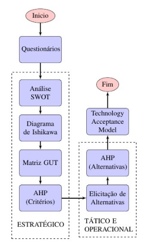

<h1 align="center">
    Auxílio ao Processo de Tomada de Decisão
</h1>

<h2 align="center">
    Desenvolvido durante o meu Trabalho de Conclusão de Curso (TCC).
</h2>

    
    
    

### Resumo

Diversos estudos afirmam que o alinhamento das ações de melhoria de processos de software (MPS) com os objetivos estratégicos de uma organização é crucial para o sucesso destas iniciativas. Este <a href="https://www.researchgate.net/profile/Adson_Cunha/publication/319450421_Strategic_alignment_of_processing_processing_processing_links/links/59aae75e0-social-processing-processing_processing_links-support-to-decision.pdf">artigo</a> apresenta um estudo qualitativo sobre a utilidade de um processo formal de tomada de decisão no alinhamento estratégico de MPS. A definição e o  refinamento do processo proposto ajudaram a desenvolver proposições teóricas de forma indutiva. Questionários adaptados do Modelo de Aceitação de  Tecnologia avaliaram positivamente tanto a facilidade de uso quanto a utilidade percebida da solução proposta. Os resultados indicam que um processo formal de tomada de decisão é útil e necessário para o alinhamentoestratégico de MPS. 

### Modelo Proposto

Apenas para esclarecer o contexto da ferramenta presente neste repositório, observe a Figura 1. Nela está representado o fluxograma do modelo proposto, onde a principal preocupação é efetuar uma conexão entre o nível estratégico e o nível operacional da organização, fazendo com que ambos possuam o mesmo entendimento do que é necessário melhorar no processo de software. 

    

<b>Figura 1.</b> Fluxograma do Modelo Proposto.

### Publicação

Este Trabalho de Conclusão de Curso (TCC), realizado em parceria com <a href="https://www.linkedin.com/in/caiqueminhare/">Caíque Minhare</a> originou, com o auxílio de mais alguns pesquisadores, a publicação de um <a href="https://www.researchgate.net/profile/Adson_Cunha/publication/319450421_Strategic_alignment_of_processing_processing_processing_links/links/59aae75e0-social-processing-processing_processing_links-support-to-decision.pdf">artigo</a> para o Simpósio Brasileiro de Qualidade de Software (SBQS) de 2017.

